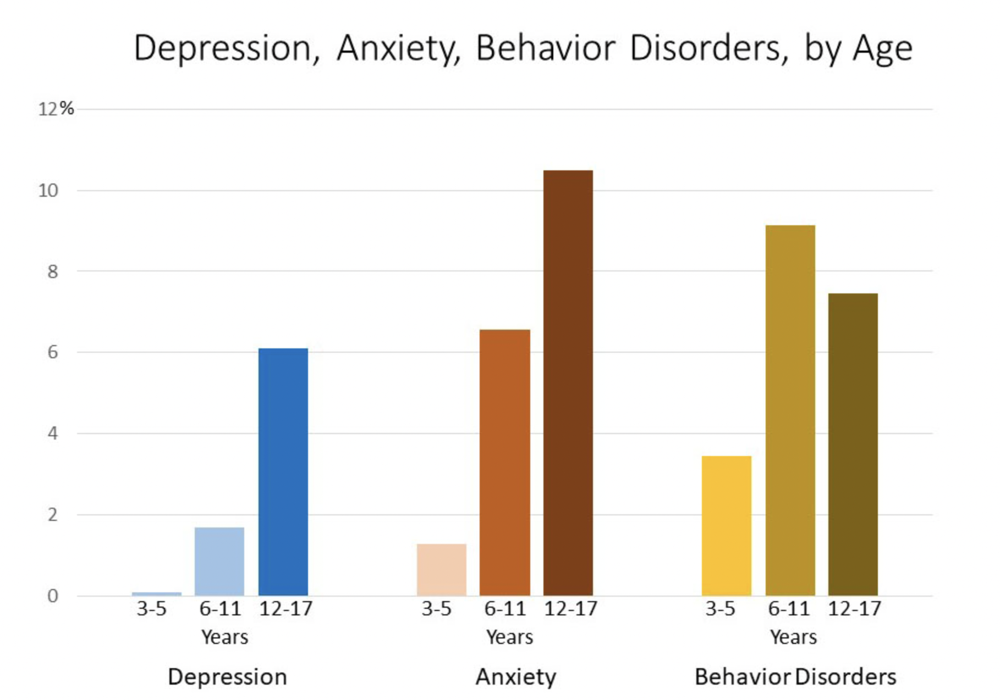
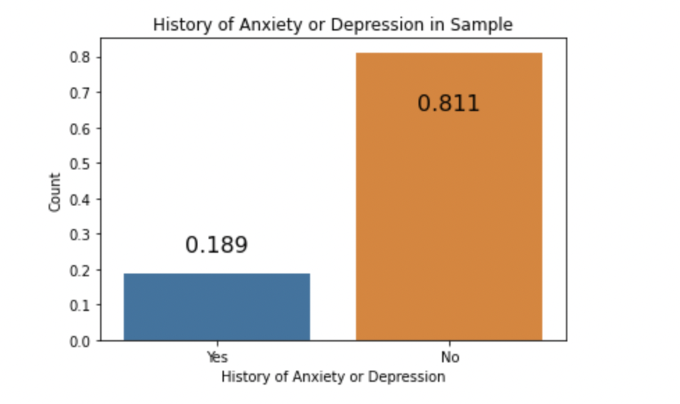
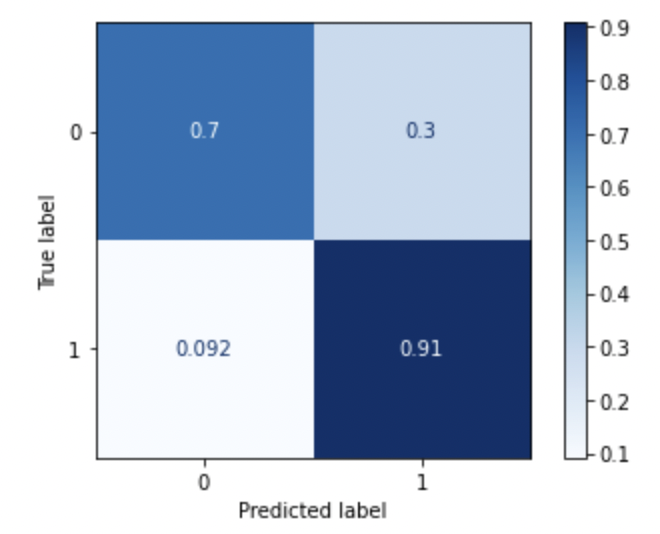

# Classifying Adolescents with Behavioral Health Problems

In a move to identify etiological, developmental, and demographic factors that influence the development of adolescent behavioral health problems, I will develop a classification model that predicts the presence of anxiety or depression in an adolescent population. The Diagnostic and Statistical Manual of Mental Disorders (DSM) is a flawed model that does not accurately capture affective experiences; in fact, the National Institute of Mental Health (NIMH) has recently prioritized funding for studies utilizing the Research Domain Criteria (RDoC) framework, which aims to look at behavioral functioning through the lenses of valence systems, cognitive systems, social processes, arousal/regulatory systems, and sensorimotor systems. Still, both of these models lack room for exogenous factors that __increase risk or resilience__ to behavioral health problems. For example, Post Traumatic Stress Disorder (PTSD) can result from trauma due to combat or sexual violence; **treatments for patients with these different types of trauma should be different.** Clearly, a diagnosis is not sufficient to tailor effective treatments for individuals. Similarly, if a person with Depression is also experiencing food insecurity, a treatment framework would not be effective until more basic needs are met for this patient. The purpose of studying adolescents is that this is critical point period in which development of mood disorders is prevelant. Early detection of mood disorders can also accelerate treatment.  

Depression and Anxiety are increasingly being studied through a developmental lens. Suicide is one the leading causes of death for children. Additionally, cognitive, physical, and emotional changes brought on by puberty leave teens particularly susceptible to mental disorders such as Depression and Anxiety. This is why this project focuses on an adolescent population.

This project will use demographic, health indicators, family history and dynamics, academic information, community features, and other non-symptom variables to train a classification model to predict whether an adolescent is experiencing depression or anxiety.

----

**Data**: National Survey of Children's Health 2019  
According to the Data Resource Center for Child & Adolescent Health:  
>The NSCH is a national survey, funded and directed by the Health Resources and Services
Administration’s Maternal and Child Health Bureau (HRSA MCHB) that provides rich data on multiple,
intersecting aspects of children’s health and well-being – including physical and mental health, access to
and quality of health care, and the child’s family, neighborhood, school, and social context. 

The survey is distributed by the US Census Bureau (since 2016). For more information about the NSCH, click [here](https://www.childhealthdata.org/learn-about-the-nsch/NSCH).  
For information about response **frequencies** across the entire sample, click [here](https://www2.census.gov/programs-surveys/nsch/technical-documentation/codebook/NSCH_2019_Screener_Frequencies.pdf). For a **codebook** of all variables in the dataset, click [here](https://www2.census.gov/programs-surveys/nsch/technical-documentation/codebook/2019-NSCH-Topical-Variable-List.pdf).

**Population**: 13-17 Year Old Children  
The initial sample of 29,433 observations was filtered to children ages 13-17 **without** the following conditions:
- Deafness
- Blindness
- Down Syndrome
- Cystic Fibrosis
- Cerebral Palsy
- Intellectual Disability
- Autism
- Developmental Delay
- Current Brain Injury

These conditions were used as exclusionary criteria as they cause atypical brain development. Depression and anxiety can and should be studied in these populations; however, for the purpose of generalizing these results, we limited the population to subjects without signicant differences in brain development. 

Out final sample consists of **9,097** observations. 18.9% of those observations are adolescents that have had Depression or Anxiety.

**Sources of bias**:   
Parents are filling out this survey. Although many of the questions don't require a subjective answer, it is worth noting that the data here is second hand reporting. Additionally, many cases of depression and anxiety go undetected - it is possible that subjects in this study classified as not having either of these disorders _does_ in fact have them. Additionally, sampling methods can affect this survey. There could be underlying characteristics overrepresented in those that complete the survey compared to those who do not. 
> - Households were randomly sampled and contacted by mail in order to identify those with one or more
children under 18 years old. In households with more than one child only one was randomly selected to
be the subject of the survey. 
> - For the 2019 NSCH, a total of 29,433 surveys were completed nationally for children between the ages of
0-17 years. The Overall Weighted Response Rate was 42.4%.

**Methods**:   
I will build a Logistic Regression ElasticNet model to predict the presence of anxiety and depression in these subjects. Feature selection will be done based on relevance, F-Regression analysis, and outside research. The metrics used will be recall, precision, f1-score, and accuracy. 

**Results**:  
The model performed well on the data considering no Depression or Anxiety symptoms (defined by the DSM) were present on the survey. On the entire dataset, the model achieved .91 recall, .42 precision, and an ROC-AUC score of .81. Recall was prioritized as the patient sample was a very small proportion of the dataset. Additionally, it was more important for feature importance to prioritize recall: the goal was not to build the most accurate model necessarily, but to identify important non-symptom features that predicted the presence of Depression or Anxiety. 

**Conclusions/Next Steps**:  
1. Bring in other NSCH data from previous years
2. Perform more feature selection/engineering to optimize model
3. Try different imputation methods to see their effect on the model
4. Recommend additional questions on the NSCH realted to Depression and Anxiety symptoms, as well as more in depth questions on the top predictive factors of these disorders we found
5. Encourage experimental research on the effects of our top predictors on adolescent Depression and Anxiety
6. Additionally, encourage research on targeted interventions involving our predictive factors, such as Bullying Awareness programs at schools

